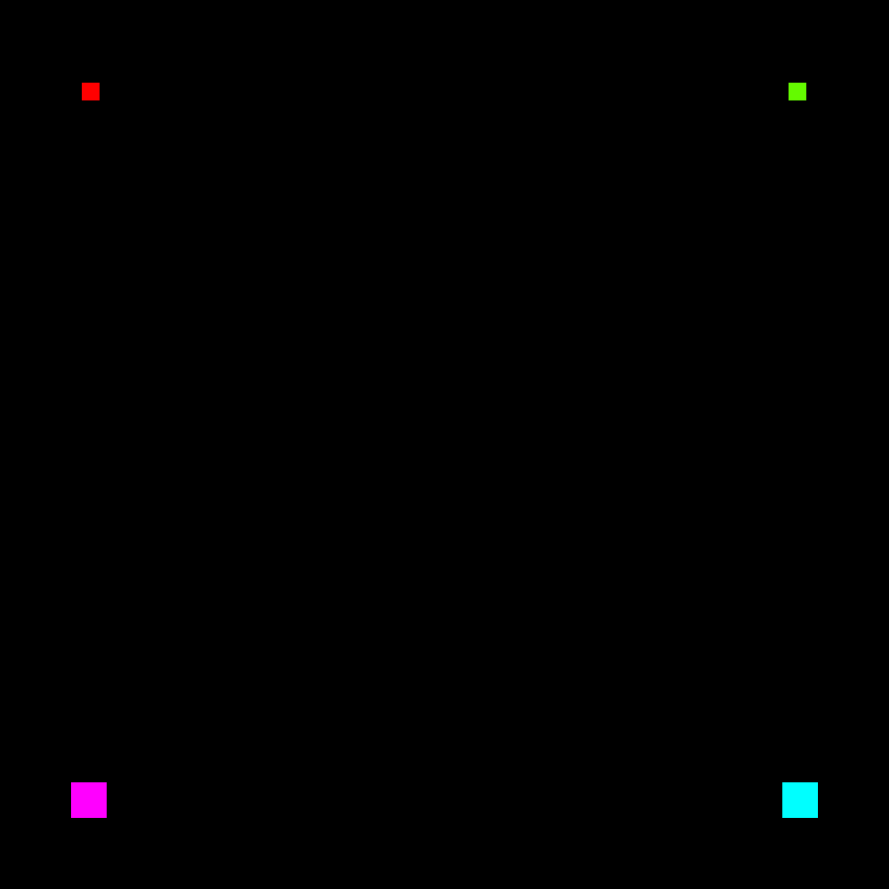
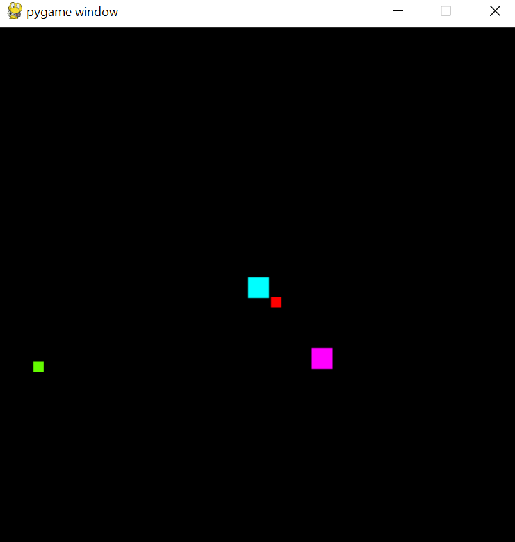
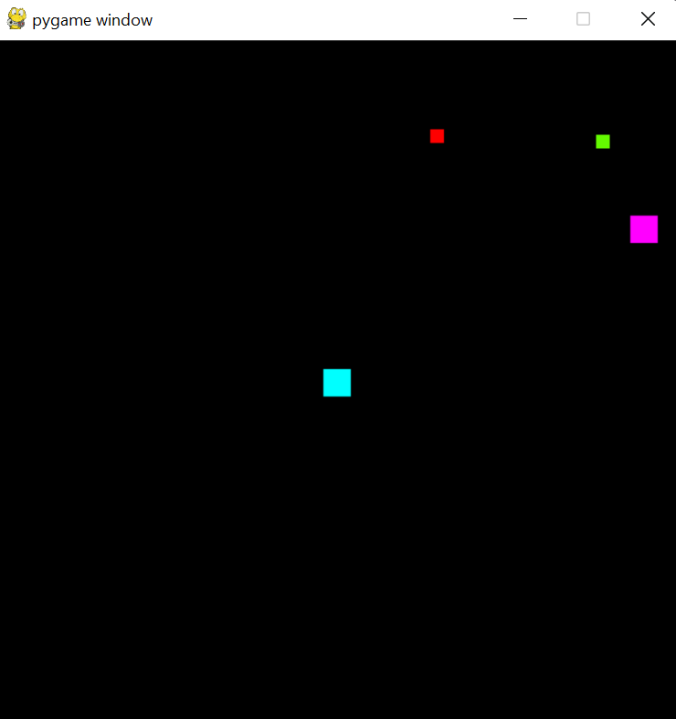
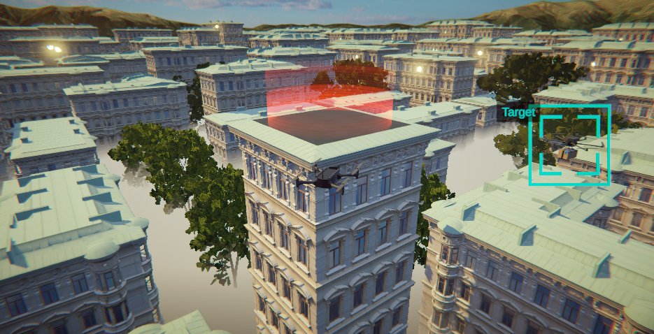
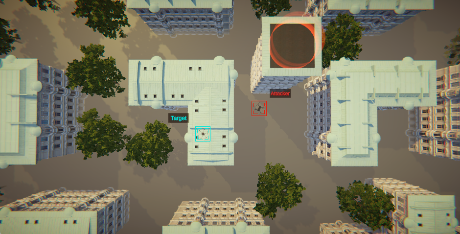

# Autonomous Drone Interception Environment

This GitHub provides the environment, the unity interface as well the trained agent following the paper *Automous Drone Interception with Reinforcement Learning*, A. Gauffriau *et al*. 

> **Note** :
> If you have access to the ACAS table via the python package *deel.datasets*, make sure you have it installed. Otherwise, we offer a surrogate model (using sklearn's Random Forest) to approximate the table.

## The GYM Environment 

Initialize the environment. The only mandatory argument is the *acs* (Anti-Collision System) that can be either *surrogate* or *acas*. 

```python
from acas_env import AcasEnv

env = AcasEnv(acs="surrogate", *args)
_ = env.reset()

env.render(mode = "rgb_array")
```




Interact with the Pygame interface of the gym env, using keyboards :
*  "**W**" Accelerate
*  "**S**" Decelerate
*  "**A**" Left
*  "**D**" Right

```python
from gym.utils import play
# First, turn the gameplay mode ON
env.gameplay_mode = True
# adapt zoom so that it fits your screen
play.play(env, zoom=0.8, fps=30)
```





## 3D Unity Interface

Download the *unityDisplay* folder from [google-drive-link](https://drive.google.com/drive/folders/1CLfuKzCHik2IqDv93RS75IhRBJZEQVxx?usp=sharing). 

** Launch Python API**

First run the API:
```script
python app.py
```

Two parameters:
*  ```randomness``` to add some randomness to the initial positions (default=0, randomness $\in [0,1]$)
* ```speed``` to set the target speed (default 400)  
* ```table``` to set Anti-Collision System (either "surrogate" or "acas")


Example:
```script
python app.py --table surrogate --randomness 1 --speed 400
```

The API is ready when the following message prompts: _Acas env ready_
Once it is ready, run *ACAS Unity.exe*




You have access to some control in the simuluation with the keyboard.
**The Cameras :**
- "**Z**" Camera Top
- "**Q**" Camera Target Drone
- "**D**" Camera Attacker Drone
- "**S**" Camera Global View of the two drones
- "**U**" To enable/disable the Locker inteface
- "**I**" To enable/disable the Info Interface
> **Note** : 
> The Keyboard is base on Azerty keyboard

## API:
Two endpoints:

* _/reset_: reset the environment and returns a state json
* _/step_: run one step in the environment and returns a state json

Both methods return a json with the following form:  

{'acas_state': 0,  
'attacker_heading': 0.785,  
'attacker_speed': 400.0,  
'attacker_x': 90000.0,  
'attacker_y': 10000.0,  
'done': False,  
'loose_zone_x': 90000.0,  
'loose_zone_y': 90000.0,  
'reward': 0,  
'target_heading': 0,  
'target_speed': 400.0,  
'target_x': 10000.0,  
'target_y': 10000.0,  
'win_zone_x': 10000.0,  
'win_zone_y': 90000.0} 


> **Note** : 
> If the drone on the screen do not move it mean that the Unity project didnt succed to connect to the API.


